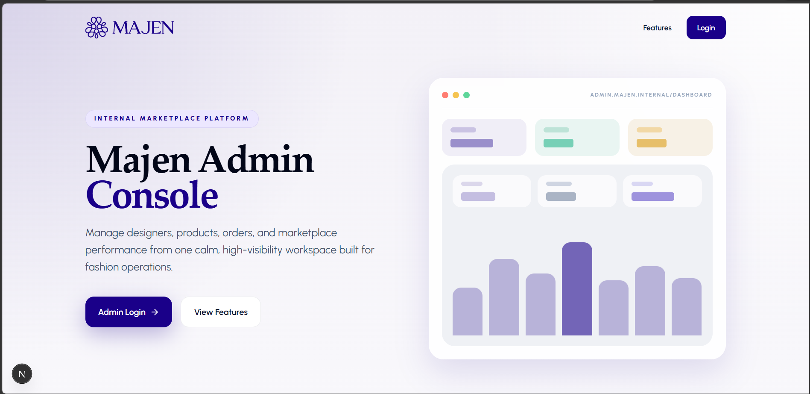
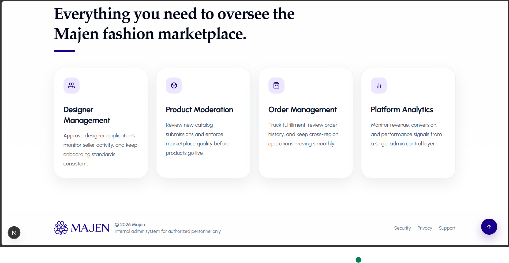

# Majen Admin Console

> A production-grade web-based admin console for the **Majen** fashion marketplace platform.

The Majen Admin Console allows platform administrators to manage designers, clients, products, orders, analytics, and platform content efficiently. Built with a modern React/Next.js stack.

---

## **Table of Contents**

1. [Project Overview](#project-overview)
2. [Features](#features)
3. [Screenshots](#screenshots)
4. [Tech Stack](#tech-stack)
5. [Folder Structure](#folder-structure)
6. [License](#license)

---

## **Project Overview**

Majen is a fashion marketplace connecting **designers in Nigeria** with **clients abroad**. The admin console is a centralized dashboard for administrators to:

- Approve/reject designer sign-ups
- Moderate product uploads and client reviews
- Manage client accounts and orders
- Monitor revenue and analytics
- Manage home page content displayed in the mobile app

---

## **Features**

- **Dashboard & Analytics**: Financial overview, revenue charts, and platform performance metrics.
- **Designer Management**: Review sign-ups, verify details, suspend/ban designers.
- **Client Management**: View client activity, order history, suspend/ban accounts.
- **Product Moderation**: Approve/reject products, respond to reviews, manage designer catalogs.
- **Order Management**: Approve/reject orders, update order tracking status.
- **Content Management**: Manage banners, “What’s New”, and “Popular on Majen” sections.
- **Reports & Moderation**: Review flagged content and take moderation actions.

---

## **Screenshots**

### **Landing Page**



### **Features Section**



---

## **Tech Stack**

- **Framework**: Next.js (App Router), TypeScript
- **Styling**: Tailwind CSS, Shadcn UI
- **State Management**: Zustand (UI state)
- **Server State**: React Query (data fetching, caching)
- **Forms**: Formik and Yup
- **Tables**: TanStack Table
- **Charts**: Recharts (Tentative)
- **Animations**: Framer Motion
- **Icons**: React Icons
- **Utilities**: Axios (API client)

---

## **Folder Structure (Tentative)**

```plaintext
src/
├─ app/                       # Next.js App Router
│  ├─ dashboard/
│  ├─ sellers/
│  ├─ clients/
│  ├─ products/
│  ├─ orders/
│  ├─ analytics/
│  └─ content/
├─ components/                # Global reusable components
│  ├─ tables/
│  ├─ modals/
│  ├─ inputs/
│  ├─ buttons/
│  ├─ cards/
│  ├─ charts/
│  └─ layout/
├─ hooks/                     # Global hooks
├─ store/                     # Zustand store
├─ services/                  # Axios API client & interceptors
├─ types/                     # TypeScript types/interfaces
├─ utils/                     # Helper functions
├─ constants/                 # API endpoints, enums
└─ styles/                    # Tailwind and global styles

```

## License

This project is proprietary and all rights are reserved by Majen.
Frontend Developed by [Davisco](https://github.com/Dhavisco).
See [LICENSE](./LICENSE) for details.
